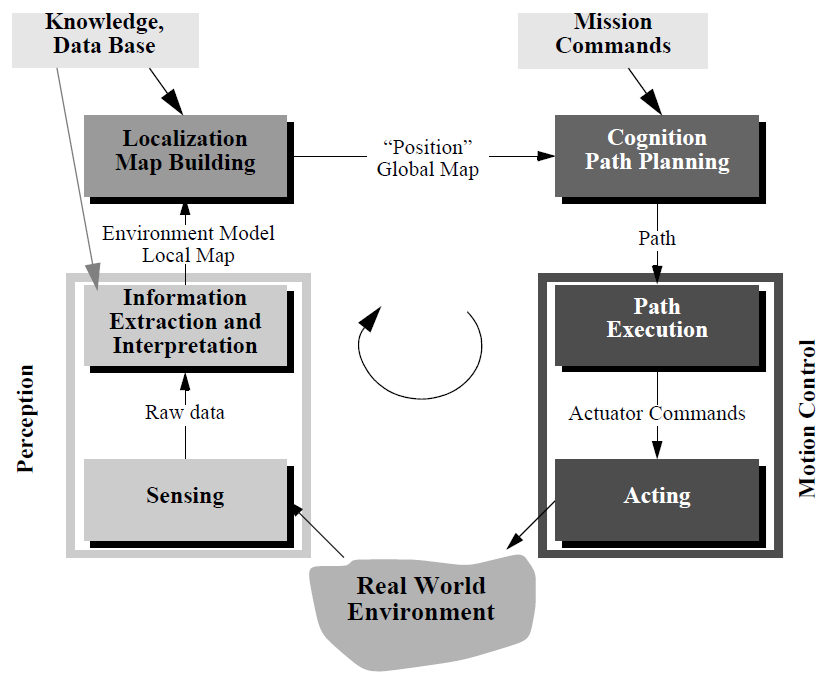
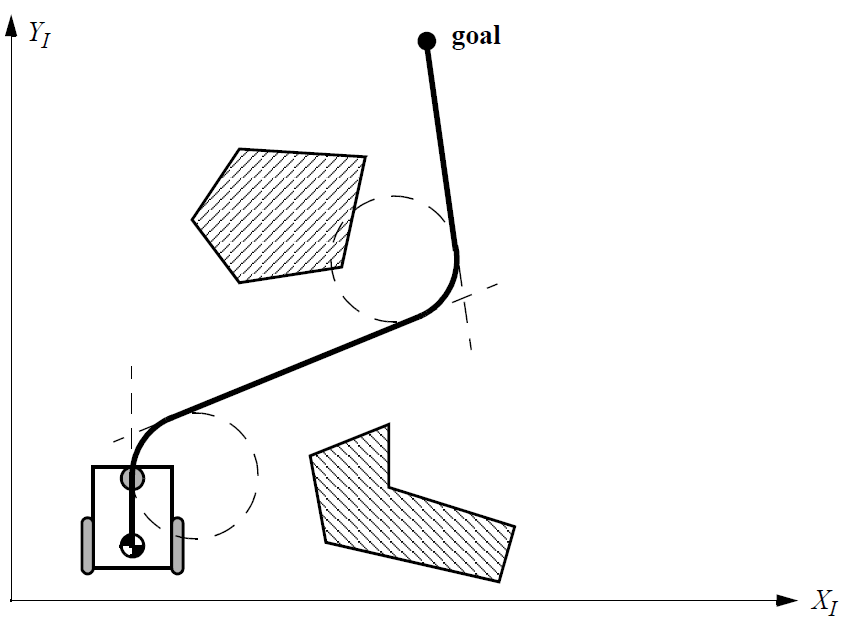
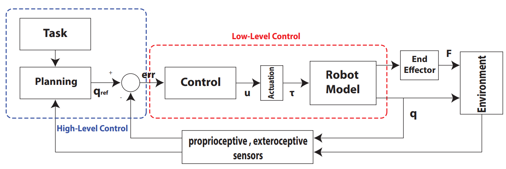
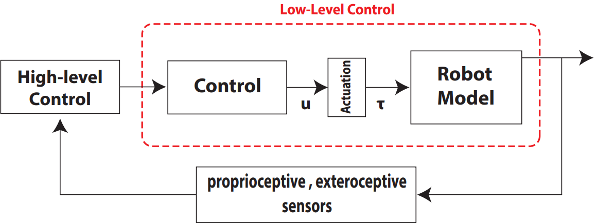
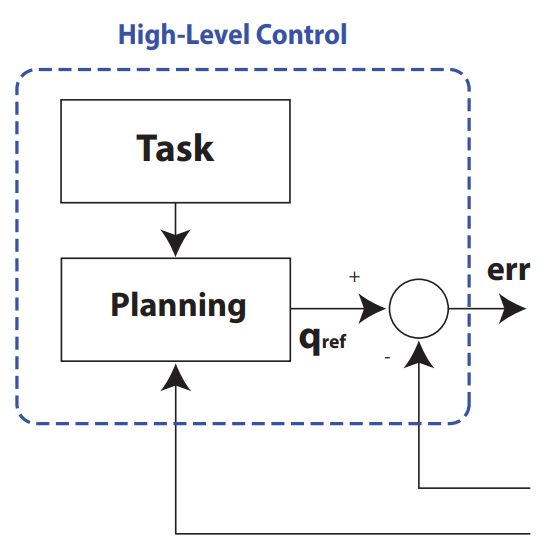

# Lesson 7: Introduction to Intelligent Mobile Robots

**Lesson learning outcomes:**

By completing this lesson, you will be better able to:

- **outline** the basics of intelligent mobile robots, its different types and sensors.
- **discuss** why AI is required for a mobile robot to perform its task full autonomously. 
- **understand** the concepts of openloop and closedloop control schemes. 

## Introduction

The very first question that comes in mind is that how a mobile robot gets its intelligence. Let's start with some definitions:

### Artificial Intelligence:

There are several definitions of artificial intelligence or AI. The most specific one is "AI is the attempt to get the robots to do things that, for the moment, people are better at." 

### Intelligent Robots:

Thus, we can define that "A robot with ability to learn from its environment and perform some tasks autonomously with high precision is called an Intelligent robot".  

### Kinds of Robots:

When we talk about mobile robots, there are several kinds of robots that come under the umbrella.

- **Ground mobile systems:** Various types of mobile platforms can be found here such as mobile vehicles with wheels or caterpillars, legged robots (humanoids or animal mimicking), or robots that mimic some other type of animal locomotion, for example, snakes. Ground mobile systems with wheels or caterpillars that do not carry the operator are often referred to as unmanned ground vehicles.
- **Aerial mobile systems:** This group consists of mobile systems that fly in a certain aerial space (airplanes, helicopters, drones, rockets, animal-mimicking flying systems; when used without a pilot they are referred to as unmanned aerial vehicles) or orbit the Earth or some other celestial body (satellites).
- **Water and underwater mobile systems:** In this group we find different types of ships, boats, submarines, autonomous underwater vehicles, etc.

We will be talking about the wheeled mobile robot in the course. There are several types of wheeled mobile robots.

- **Differential Drive Robots:** Two independently driven wheels (common in robots and small vehicles).
- **Holonomic Robots:** Wheels that can move in any direction (high maneuverability).
- **Omnidirectional Robots:** Wheels with rollers for translation and rotation (e.g., omnidirectional wheels).
- **Tracked Robots:** Continuous tracks for stability and off-road capabilities (e.g., tank-like robots).

A robot can be represented by its kinematics model and dynamic model.

- **The kinematic model** describes geometric relationships that are present in the system. It describes the relationship between input (control) parameters and the behavior of a system given by state-space representation. A kinematic model describes system velocities and is presented by a set of differential first-order equations.
- **Dynamic models** describe a system motion when forces are applied to the system. This model includes the physics of motion where forces, energies, system mass, inertia, and velocity parameters are used.# Introduction to Intelligent Mobile Robots

**Lesson learning outcomes:**

 By completing this lesson, you will be better able to:

  - **outline** the basics of intelligent mobile robots, its different types and sensors.
  - **discuss** why AI is required for a mobile robot to perform its task full autonomously. 
  - **understand** the concepts of openloop and closedloop control schemes. 

## Introduction

The very first question that comes in mind is that how a mobile robot gets its intelligence. Let's start with some definitions:

### Artificial Intelligence:

There are several definitions of artificial intelligence or AI. The most specific one is "AI is the attempt to get the robots to do things that, for the moment, people are better at." 

### Intelligent Robots:

Thus, we can define that "A robot with ability to learn from its environment and perform some tasks autonomously with high precision is called an Intelligent robot".  

### Kinds of Robots:

When we talk about mobile robots, there are several kinds of robots that come under the umbrella.

- **Ground mobile systems:** Various types of mobile platforms can be found here such as mobile vehicles with wheels or caterpillars, legged robots (humanoids or animal mimicking), or robots that mimic some other type of animal locomotion, for example, snakes. Ground mobile systems with wheels or caterpillars that do not carry the operator are often referred to as unmanned ground vehicles.
- **Aerial mobile systems:** This group consists of mobile systems that fly in a certain aerial space (airplanes, helicopters, drones, rockets, animal-mimicking flying systems; when used without a pilot they are referred to as unmanned aerial vehicles) or orbit the Earth or some other celestial body (satellites).
- **Water and underwater mobile systems:** In this group we find different types of ships, boats, submarines, autonomous underwater vehicles, etc.

We will be talking about the wheeled mobile robot in the course. There are several types of wheeled mobile robots.

- **Differential Drive Robots:** Two independently driven wheels (common in robots and small vehicles).
- **Holonomic Robots:** Wheels that can move in any direction (high maneuverability).
- **Omnidirectional Robots:** Wheels with rollers for translation and rotation (e.g., omnidirectional wheels).
- **Tracked Robots:** Continuous tracks for stability and off-road capabilities (e.g., tank-like robots).

A robot can be represented by its kinematics model and dynamic model.

- **The kinematic model** describes geometric relationships that are present in the system. It describes the relationship between input (control) parameters and the behavior of a system given by state-space representation. A kinematic model describes system velocities and is presented by a set of differential first-order equations.
- **Dynamic models** describe a system motion when forces are applied to the system. This model includes the physics of motion where forces, energies, system mass, inertia, and velocity parameters are used.

## Kinematics of Wheeled Mobile Robots

Several types of kinematic models exist:

- **Internal kinematics:** explains the relation between system internal variables (e.g., wheel rotation and robot motion).
- **External kinematics:** describes robot position and orientation according to some reference coordinate frame.
- **Direct kinematics and inverse kinematics:** Direct kinematics describes robot states as a function of its inputs (wheel speeds, joint motion, wheel steering, etc.). From inverse kinematics, one can design a motion planning, which means that the robot inputs can be calculated for a desired robot state sequence.
- **Motion constraints** appear when a system has less input variables than degrees of freedom (DOFs). Holonomic constraints prohibit certain robot poses while a nonholonomic constraint prohibits certain robot velocities (the robot can drive only in the direction of the wheels’ rotation).

Figure below depicts an abstract control scheme for mobile robot systems that we will use throughout this course. This figure identifies many of the main bodies of knowledge associated with mobile robotics.

### Kinematics: Mobile Robot Vs Robotic Manipulator

- **Workspace:** A manipulator robot’s workspace is crucial because it defines the range of possible positions that can be achieved by its end effector relative to its fixture to the environment. A mobile robot’s workspace is equally important because it defines the range of possible poses that the mobile robot can achieve in its environment.

- **Controllability:** The robot arm’s controllability defines the manner in which active engagement of motors can be used to move from pose to pose in the workspace. Similarly, a mobile robot’s controllability defines possible paths and trajectories in its workspace.

- **Dynamic Places:** Robot dynamics places additional constraints on workspace and trajectory due to mass and force considerations. The mobile robot is also limited by dynamics; for instance, a high center of gravity limits the practical turning radius of a fast, car like robot because of the danger of rolling.

But the significant difference between a mobile robot and a manipulator arm also introduces a significant challenge for position estimation. A manipulator has one end fixed to the environment. Measuring the position of an arm’s end effector is simply a matter of understanding the kinematics of the robot and measuring the position of all intermediate joints. The manipulator’s position is thus always computable by looking at current sensor data.

On the other hand, mobile robot is a self-contained automaton that can wholly move with respect to its environment. There is no direct way to measure a mobile robot’s position instantaneously. Instead, one must integrate the motion of the robot over time. Add to this the inaccuracies of motion estimation due to slippage and it is clear that measuring a mobile robot’s position
precisely is an extremely challenging task.

For the further reading on the topic, you are encouraged to read topic 3.2, 3.3 and 3.4 from the Siegwart, R., Nourbakhsh, I.R. and Scaramuzza, D., 2011. Introduction to autonomous mobile robots. MIT press.

### What is the real Challenge then?

The major question while designing a mobile robot is "under what conditions can a mobile robot travel from the initial pose to the goal pose in bounded time?". Answering this question requires knowledge, both knowledge of the robot kinematics and knowledge of the control systems that can be used to actuate the mobile robot. Mobile robot control is therefore a return to the practical question of designing a real-world control algorithm that can drive the robot from pose to pose using the trajectories demanded for the application.

#### Control Design for Mobile Robots

There are two classical ways to design a control system for a mobile robot.

- Open-loop Control Design
- Closed-loop Control Design

##### Open-loop Control

The objective of a open-loop kinematic controller is to follow a trajectory described by its position or velocity profile as a function of time. This is often done by dividing the trajectory (path) in motion segments of clearly defined shape, for example, straight lines and segments of a circle. The control problem is thus to pre compute a smooth trajectory based on line and circle
segments that drives the robot from the initial position to the final position (figure below).

This approach can be regarded as open-loop motion control, because the measured robot position is not fed back for velocity or position control. It has several disadvantages:

- It is not at all an easy task to pre compute a feasible trajectory if all limitations and constraints of the robot’s velocities and accelerations have to be considered.
- The robot will not automatically adapt or correct the trajectory if dynamic changes of the environment occur.
- The resulting trajectories are usually not smooth, because the transitions from one trajectory segment to another are, for most of the commonly used segments (e.g., lines and part of circles), not smooth. This means there is a discontinuity in the robot’s acceleration.

##### Feedback/Closed-loop Control

A more appropriate approach in motion control of a mobile robot is to use a real-state feedback controller. With such a controller the robot’s path-planning task is reduced to setting intermediate positions (subgoals) lying on the requested path.

Closed-loop control is a form of motion control in which the path, or trajectory, of the device is corrected at frequent intervals. After motion begins, a position sensor detects possible errors in the trajectory. If an error is detected, the sensor outputs a signal that operates through a feedback circuit to bring the manipulator back on course. The term derives from the fact that the feedback and control-signal circuits together constitute a closed loop. The main asset of closed-loop control is accuracy. In addition, closed-loop control can compensate for rapid, localized, or unexpected changes in the work environment. The principal disadvantages are greater cost and complexity than simpler schemes such as ballistic control. The most common type of classical control used in industry is Proportional Integral Derivative (PID) controller.

A general control system follows the methodology given in picture below. 

The actuators are usually the DC motors, step-by-step motors etc. The end effector, as the name say, is the general purpose tool or gripper or hand to mimic the grasping capability for the robotic manipulator. There are different kinds of Sensors Proprioceptive like encoder, gyro, etc. and Exteroceptive sensors like bumpers, rangefinders (infrared, ultrasonic), laser and vision sensors like mono, stereo etc. In order to make useful decision based on these sensor measurements, there are two level of control in each loop: Low-level control and High-level control. 

The low level control is shown in figure below. In the low level control, following are the fundamental ideas:

- High-gain PI controllers control the robot’s motors so that the robot moves according to the desired speed profile. 
- The low-level control deals only with the robot actuators control according to the high-level control instructions.
- If the gains are high enough, the low-level control makes the robot a purely kinematic system.

On the other hand, the high level controller is given in picture below.

- It processes and computes the signals to send to the low-level controller using data coming from sensors.
- From its point of view, the robot behaves as a purely kinematic system.
- For mobile robots, speed control signals are used.

#### Example: Control of WMR

For the sake of an example, lets think about a wheeled mobile robots. The two controllers can be expressed as:

**Low-Level Control:** 
- Internal loop on the motors side for controlling the robot actuation.
- It is a simple PI for electric drives (linear systems).
- It is not affected by the non-holonomic constraints introduced by the wheels.
- Known and solved issues

**High-Level Control**
- It defines the motion and the behavior of the robot based on the task to be performed
- It must consider the kinematic model
- Subject to the constraints of the wheels
- It has to control a nonlinear and complex system

Now we know some basics about controlling the mobile robot, the real challenge comes how a robot see the world.

### Sensing

The most important question for a mobile robot to go from some initial position to a desired goal position is to know about the following questions:

- Where am I relative to the world and how can the robot model/recognize the environment?
- What is around me?

In order to get answers for these questions, a robot is equipped with onboard sensors like vision, stereo, range sensors, LIDAR. The sensors are classified in two major categories, i.e. proprioceptive/exteroceptive and passive/active.

- **Proprioceptive sensors** measure values internal to the system (robot); e.g. motor speed, wheel load, robot arm joint angles, battery voltage.
- **Exteroceptive sensors** acquire information from the robot’s environment; e.g. distance measurements, light intensity, sound amplitude. Hence exteroceptive sensor measurements are interpreted by the robot in order to extract meaningful environmental features.
- **Passive sensors** measure ambient environmental energy entering the sensor. Examples of passive sensors include temperature probes, microphones and CCD or CMOS cameras.
- **Active sensors** emit energy into the environment, then measure the environmental reaction. Because active sensors can manage more controlled interactions with the environment, they often achieve superior performance.

The readers are encouraged to read Chapter 4 of Siegwart, R., Nourbakhsh, I.R. and Scaramuzza, D., 2011. Introduction to autonomous mobile robots. MIT press, for a more details perspective of different sensors and perception for mobile robots.

### Perception

Perception for mobile robots refers to the ability of a robotic system to gather information about its environment through various sensors and then process and interpret that information to make informed decisions and navigate autonomously. Perception is a fundamental component of mobile robot autonomy, as it allows the robot to understand and interact with its surroundings.

Key aspects of perception for mobile robots include:

- **Sensing:** Mobile robots are equipped with a variety of sensors, such as cameras, LiDAR (Light Detection and Ranging), ultrasonic sensors, radar, and more. These sensors collect data about the robot's surroundings, including information about objects, obstacles, terrain, and other relevant environmental features.

- **Sensor Fusion:** Often, mobile robots use multiple sensors of different types to create a more comprehensive understanding of their surroundings. Sensor fusion techniques combine data from various sensors to provide a more accurate and robust perception of the environment.

- **Object Detection and Recognition:** Mobile robots need to detect and recognize objects in their environment. This can include identifying obstacles, people, other robots, landmarks, or any other objects relevant to their task.

- **Mapping:** Mobile robots create maps of their surroundings, known as occupancy grids or environmental maps. These maps help the robot understand where it is located in relation to the environment and plan paths or make navigation decisions.

- **Localization:** Localization is the process of determining the robot's position in a known map or within its environment. Mobile robots often use techniques like SLAM (Simultaneous Localization and Mapping) to estimate their position and orientation.

- **Obstacle Avoidance:** Robots must be able to detect and avoid obstacles in real-time to navigate safely. Perception systems provide information about the location and shape of obstacles, allowing the robot to plan a collision-free path.

- **Environment Understanding:** Perception systems may also provide information about the type of terrain, the presence of specific landmarks, or environmental conditions like lighting or weather, which can impact the robot's behavior and decision-making.

- **Semantic Understanding:** Some advanced mobile robots can understand the semantics of their environment. For example, they can recognize specific objects or understand human commands and gestures.

Perception for mobile robots is essential for various applications, such as autonomous vehicles, delivery robots, search and rescue robots, agricultural robots, and more. Advances in sensors, computer vision, machine learning, and artificial intelligence have significantly improved the perception capabilities of mobile robots, enabling them to operate safely and effectively in a wide range of environments and tasks.

## Why a robot needs Intelligence?

It is usually fine to ask robot to perform a same task repeatedly without any human intervention under ideal conditions. But this is usually not the case. In a real world scenario, the robot has to learn from its environment, surroundings and interactions with things like we human do. The field of AI can help the robot to get this insight. There are seven main areas in AI which helps the robot to perform tasks intelligently. 

#### Knowledge representation. 

An important, but often overlooked, issue is how the robot represents its world, its task, and itself. Suppose a robot is scanning a room for an elderly person to assist. What kind of data structures and algorithms would it take to represent what a human looks like or what the human might need? How does a program capture everything important so as not to become computationally intractable? AI robotics explores the tension between the symbolic world representations that are easy for computers to create optimal paths through versus the direct perception used by animals that work directly from perception.

#### Understanding natural language. 

Natural language is deceptively challenging, apart from the issue of recognizing words which is now being done by commercial products such as Siri and Alexa. It is not just a matter of looking up words, which is the subject of the following apocryphal story about AI. The story goes that after Sputnik went up, the US government needed to catch up with the Soviet scientists. However, translating Russian scientific articles was time consuming and not many US citizens could read technical reports in Russian. Therefore, the US decided to use these newfangled computers to create translation programs. The day came when the new program was ready for its first test. It was given the proverb: the spirit is willing, but the flesh is weak. The reported output: the vodka is strong, but the meat is rotten. AI robotics explores the implicit and explicit communication needed for comfortable social interaction with robot.

#### Learning. 

Imagine a robot that could be programmed by just watching a human, or that a robot could learn by just repeatedly trying trying a new task by itself. Or that a robot experimented with a task through trial and error to generate a new solution. AI robotics is a study of the different types of learning and how learning can be applied to different functions.

#### Planning and problem solving. 

Intelligence is associated with the ability to plan actions needed to accomplish a goal and solve problems when those plans fail. One of the early childhood fables, the Three Pigs and the Big, Bad Wolf, involves two unintelligent pigs who do not plan ahead and an intelligent pig who is able to solve the problem of why his brothers’ houses have failed, as well as generate a new plan for an unpleasant demise for the wolf. AI robotics relies on planning and problem solving to cope with the unpredictability of the real world.

#### Inference. 

Inference is generating an answer when there is not complete information. Consider a planetary rover looking at a dark region on the ground. Its range finder is broken and all it has left is its camera and a fine AI system. Assume that depth information cannot be extracted from the camera. Is the dark region a canyon? Is it a shadow? The rover will need to use inference either to actively or passively disambiguate what the dark region is (e.g., kick a rock at the dark area versus reason that there is nothing nearby that could create that shadow). AI robotics techniques are increasingly engaging in inference.

#### Search. 

Search does not necessarily mean searching a large physical space for an object. In AI terms, search means efficiently examining a knowledge representation of a problem (called a “search space”) to find the answer. Deep Blue, the computer that beat World Chess master Garry Kasparov, won by searching through almost all possible combinations of moves to find the best choice. The legal moves in chess, given the current state of the board, formed the search space. Data mining or Big Data is a form of search. AI robotics uses search algorithms in generating optimal solutions in navigation or searching a knowledge representation.

#### Vision. 

Vision is possibly the most valuable sense humans have. Studies by Harvard psychologist, Steven Kosslyn, suggest that much of human problem solving capabilities stems from the ability to visually simulate the effects of actions in our head. As such, AI researchers have pursued creating vision systems both to improve robotic actions and to supplement other work in general machine intelligence. AI robotics relies heavily on computer vision to interpret video data and also the RGBD cameras, such as Microsoft’s Kinect.

## Your turn:
Follow [Worksheet7](worksheet7.md) to understand how to deal with ros2 programmatically.
  <!-- [worksheet8.1](../../workseets/worksheet8.1.ipynb)

  [worksheet8.2](../../workseets/worksheet8.2.ipynb) -->

<!-- # Unit's conclusion
This lesson concludes our unit where we have studied important formulations of RL all of which assumed that we use a table representation for our state space. In the next unit, we will study other offline and fully online RL algorithms that use bootstrapping. Additionally, we will study planning algorithms and then use function approximation instead of a table to represent the state space that can be continuous and infinite. -->

# Unit's conclusion
This lesson concludes our unit where we have studied important formulations of RL all of which assumed that we use a table representation for our state space. In the next unit, we will study other offline and fully online RL algorithms that use bootstrapping. Additionally, we will study planning algorithms and then use function approximation instead of a table to represent the state space that can be continuous and infinite.