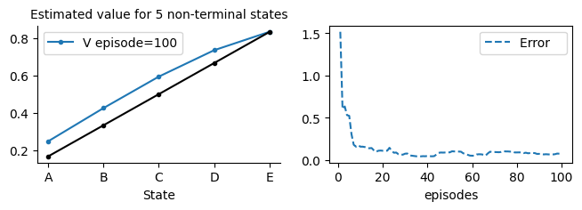
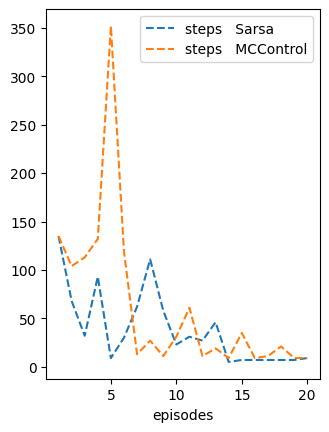
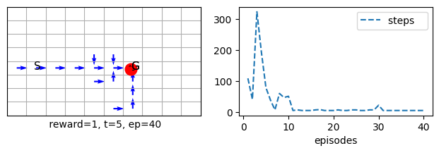
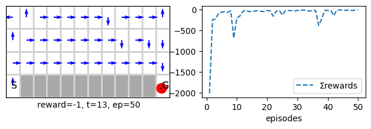
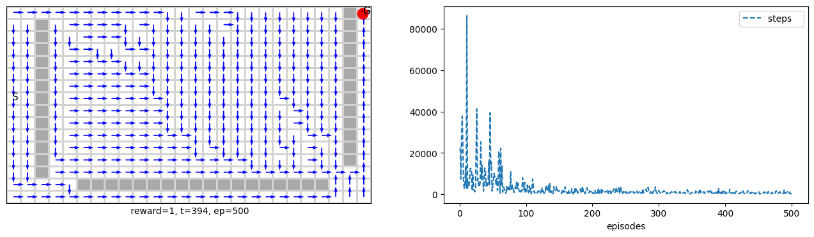

# Introduction to Bootstrapping
In this and subsequent units, we cover a set of RL algorithms that use bootstrapping, a powerful idea that allows us to create online updates that do not wait until the end of an episode to learn from the experience, live as it comes. We will continue on the tabular method, cover planning, and then move to function approximation methods. Along the way, we cover encoding techniques for state space traditionally used in RL, such as tile coding. On the function approximation, we will assume a linear model in this unit. We cover non-linear models from an application perspective in the subsequent unit. We are mainly concerned with regression not classification from a machine learning perceptive.

The settings are still the same as that of an MDP. However, we assume that the state space is large and may not be practical to represent each state as an entry in a table. The states might also not manifest themselves clearly, and only we can obtain some observations about them. These observations result in a set of numerical, categorical or boolean features which we can then numerically deal with them as we did in earlier modules.

**Unit 3: Learning Outcomes**  
By the end of this unit, you will be able to:  

1. **Assess** the role of bootstrapping in RL and its impact on learning efficiency.  
2. **Explain** n-step methods and the trade-offs associated with different values of n.  
3. **Compare** n-step backup action-value-based control methods with direct policy estimation methods.  
4. **Evaluate** how Temporal Difference (TD) methods obtain biased but low-variance estimates through environment interaction.  
5. **Analyze** how actor-critic methods achieve biased but low-variance estimation through interaction with the environment.  
6. **Discuss** the trade-offs between online and offline RL algorithms.  
7. **Design** planning methods that incorporate model learning into RL.  

---

# Lesson 7-Tabular Methods: Temporal Difference Learning

**Learning outcomes**

1. understand the idea of bootstrapping and how it is being used in TD
2. understand the differences between MC and TD and appreciate their strengths and weaknesses
3. understand how to use the ideas of TD to extend it to a control method such as Sarsa and Q-learning


In this lesson, we explore Temporal Difference (TD) learning, a fundamental concept in reinforcement learning (RL). TD combines bootstrapping and experience-based updates to refine its predictions. Bootstrapping refers to the process of using the agent’s own estimates to update its future estimates, guided only by rewards as a form of indirect ground truth. While this might seem surprising—since we are not relying on a direct ground truth—TD methods have strong theoretical guarantees of convergence, typically reaching solutions that are close to optimal.

One major advantage of TD learning is its ability to update predictions online, without waiting for an episode to end, unlike Monte Carlo (MC) methods. This makes TD significantly more efficient and often leads to faster convergence in practice. The underlying idea aligns with Generalized Policy Iteration (GPI): gradually improving predictions without waiting for complete information. This approach is similar to stochastic mini-batch updates in machine learning, where the model eagerly incorporates any available information while continuously refining its predictions.

In this lesson, we will also design TD-based control algorithms, covering both classic and modern approaches, including Sarsa, Expected Sarsa, Q-learning, and Double Q-learning. We will rigorously test these methods using the infrastructure built in the previous lesson. Finally, we will introduce Actor-Critic, a policy gradient algorithm that leverages both TD updates and REINFORCE for control.


**Plan**
As usual, in general there are two types of RL problems that we will attempt to design methods to deal with 
1. Prediction problem
For These problems we will design Policy Evaluation Methods that attempt to find the best estimate for the value-function given a policy.


2. Control problems 
For These problems we will design Value Iteration methods which utilise the idea of Generalised Policy Iteration. They attempt to find the best policy, via estimating an action-value function for a current policy then moving to a better and improved policy by choosing a greedy action often. We will then move to Policy Gradient methods that directly estimate a useful policy for the agent by maximising its value function.

Ok, so we start by implementing the TD algorithm. Due to the way we structured our code and classes, it is relatively simple and straightforward to define any online and offline methods. TD is an online method that will be called in *each step during an episode*. We, therefore, can turn off the storage because we do not need it, but leaving it will not hurt the grid problems we are tackling. It will consume some memory and a few extra milliseconds of processing. For more difficult problems, we need to utilise the memory to train anyway, as we shall see in the Application unit.

We also would need to pass a learning step as we did for the MC algorithm. A learning step dictates how much error percentage will be considered when we update the value function. Sometimes we could go all the way α=1 when the algorithm is tabular, and the problem is simple. For most of the problems and algorithms we tackle, however, this is not desirable, and we set α=.1 or less to ensure the algorithm performs well on the common states and is acceptable on less common states. MC, however, is particularly sensitive towards this α, and we often would need to set it to smaller values such as .01.

## Temporal-Difference (TD) Learning (prediction)
Earlier, in Lesson 6, we saw that the constant-\(\alpha\) Monte Carlo (MC) prediction method has an update rule of the form:

\[
    V(S_t) \leftarrow V(S_t) + \alpha \left( G(S_t) - V(S_t) \right)
\]

The core idea behind several well-known incremental reinforcement learning (RL) algorithms is to replace \( G_t \) with an estimate.  

Our goal in Temporal-Difference (TD) learning is to combine the advantages of Monte Carlo (MC) methods and Dynamic Programming (DP). Specifically, we want the model-free nature of MC, which does not require a model of the environment and learns directly from experience and interaction (unlike DP). The above update rule already satisfies this requirement.  

At the same time, we seek the fast convergence of DP while avoiding its high computational cost. Using \( R_{t+1} + \gamma V(S_{t+1}) \) in place of \( G_t \) satisfies this requirement—let's unpack this further.  

If we recall how DP, particularly policy evaluation, updates its estimates, we see that it relies on the Bellman equation:

\[
V^\pi(s) = \mathbb{E}_\pi \left[ R_{t+1} + \gamma V^\pi(S_{t+1}) \mid S_t = s \right]
\]

TD learning leverages the Bellman equation and assumes that since the agent interacts with the environment according to its current policy, the experience is drawn according to the policy distribution \( \pi \). This means that the expectation \( \mathbb{E}_\pi \) in the Bellman equation is naturally satisfied if we use this experience from \( \pi \) to update the estimate of the value function \( V^\pi(s) \). Thus, the learned value function should follow and satisfy the Bellman equation. If it does not, it should be adjusted accordingly.  

(Recall that any expectation can be approximated by sampling and averaging from the underlying distribution, as per the law of large numbers. Instead of averaging, we use a step-size parameter \( \alpha < 1 \) to continuously adjust the estimates, similar to the constant-\(\alpha\) MC method.)  

According to the Bellman equation, \( R_{t+1} + \gamma V(S_{t+1}) \) serves as a good candidate estimate for \( G_t \), leveraging bootstrapping in the same way as DP. In other words, the state-value function \( V(S_t) \) should remain close to \( R_{t+1} + \gamma V(S_{t+1}) \). If it deviates, it should be adjusted in that direction.  

Thus, TD replaces \( G_t \) with \( R_{t+1} + \gamma V(S_{t+1}) \) in the constant-\(\alpha\) MC update rule:

\[
    V(S_t) \leftarrow V(S_t) + \alpha \left(R_{t+1} + \gamma V(S_{t+1}) - V(S_t) \right)
\]

This formulation allows TD learning to balance between MC and DP, providing a practical and efficient approach to value estimation in reinforcement learning. It adheres to the incremental nature of the constant-\(\alpha\) MC method while also enabling an *online* learning approach rather than the *end-of-episode* learning used in MC. At the same time, it allows for better and faster convergence, similar to DP.  

**Key Components:**

- \( \alpha \) is the step-size (learning rate),
- \( R_{t+1} \) is the reward received after taking action in \( S_t \),
- \( \gamma \) is the discount factor,
- \( V(S_{t+1}) \) is the estimate of the next state's value.

Unlike Monte Carlo (MC) methods, which require complete episodes (including constant-\(\alpha\) MC), TD methods update values truly *incrementally* after each time step, making them more efficient for continuous or long-horizon problems. The replacement of \( G_t \) with an estimate introduces bias into TD (due to bootstrapping), but it also reduces variance.  

In machine learning, the **bias-variance trade-off** is a common phenomenon, and in RL, we generally prefer lower variance since it stabilizes learning and allows for a smoother experience. TD tends to be faster and more sample-efficient than MC, making the bias-variance trade-off well worth it. Additionally, its ability to *incrementally* update the estimate *as rewards are collected* makes it a powerful tool in reinforcement learning.  


Below we show the pseudocode for the TD algorithm.

\(
\begin{array}{ll}
\textbf{Algorithm: } \text{TD(0) Prediction} \\
\textbf{Input: } \text{Policy } \pi, \text{ step-size } \alpha, \text{ discount factor } \gamma \\
\textbf{Initialize: }  V(s) \leftarrow 0, \forall s \in S \\
\textbf{Loop for each episode:} \\
\quad \text{Initialize } s \\
\quad \textbf{Loop for each step } t \textbf{ until episode ends:} \\
\quad \quad \text{Take action } a \sim \pi(s), \text{ observe } r, s' \\
\quad \quad V(s) \leftarrow V(s) + \alpha \left( r + \gamma V(s') - V(s) \right) \\
\quad \quad s \leftarrow s' \\
\textbf{Return: } V(s), \forall s \in S \\
\end{array}
\)

---

### TD vs. MC Summary

| Feature                        | Temporal-Difference (TD)       | Monte Carlo (MC)           |
|---------------------------------|--------------------------------|----------------------------|
| **Update**                      | After each time step           | After full episode         |
| **Exploration Requirement**     | Can learn from incomplete episodes | Requires complete episodes |
| **Variance**                    | Lower variance due to bootstrapping | Higher variance since full returns are used |
| **Bias**                        | More biased as it relies on current estimates | Less biased since it uses true returns |
| **Sample Efficiency**           | More efficient, updates per time step | Less efficient, updates once per episode |
| **Suitability**                 | Better for continuous/long tasks and even episodic | Works well for episodic tasks |

TD methods blend **bootstrapping (like Dynamic Programming)** and **sampling (like MC)**, making them a flexible and powerful approach for reinforcement learning.

### TD Implementation

Below we provide you with the Python code to implement this algorithm.

```python
class TD(MRP):
    # ----------------------------- 🌖 online learning ----------------------    
    def online(self, s, rn,sn, done, *args): 
        self.V[s] += self.α*(rn + (1- done)*self.γ*self.V[sn] - self.V[s])
```
That's it, this is all what you need to implement TD!. Belwo we explain the different parts of the code so that you become familiar with it.


#### Close to the Update Rule:
The code is designed to directly follow the TD update rule for value estimation:

\[
V(S_t) \leftarrow V(S_t) + \alpha \left( R_{t+1} + \gamma V(S_{t+1}) - V(S_t) \right)
\]

- **\( r_n \)** represents the immediate reward \( R_{t+1} \),
- **\( s_n \)** is the next state \( S_{t+1} \),
- **\( done \)** is a flag indicating whether the episode has ended or not.

#### Handling Terminal States:
Notice that \( V[s_{t+1}] \) is multiplied by (1 - done).

This ensures that when the episode ends (i.e., when the agent reaches the goal or completes the task), the value of \( V[s_{t+1}] \) is not used in the update. Instead, only the final reward \( r_{t+1} \) will contribute to the update. This is crucial for handling terminal states, and it saves you from having to handle terminal states separately in the environment. Since in deed, the value of  penultimate terminal state, must equate the rewards for ending in a terminal state and no need to have \( V[s_{t+1}] \) as it = 0 by definition.

- Without this multiplication, you might need to treat goal states uniquely (for example, by setting \( V[s_{t+1}] = 0 \) when \( s_{t+1} \) is the goal, or by checking the **done** flag in the environment).
- By applying this multiplication, we explicitly ensure the correct behavior in terminal states, which is preferred for clarity and maintainability.

#### No Use of "a" and "an":
The function `online()` does not use the arguments **"a"** and **"an"** because TD is focused on **value prediction**, not action selection. At this stage, we are estimating the value of states under a policy, without involving actions or control. Actions come into play once we move from prediction to control (which is the next step in RL).

#### Online Learning:
- TD learning is an online algorithm, meaning it updates the value estimate after each time step, therefore its update must be implemented by *overriding* this function from the MRP class.
- Unlike Monte Carlo (MC) methods and other offline methods, which require storing experiences for full episodes before updating, TD updates its estimate after each step, making it more *memory-efficient*. This is particularly useful in problems where episodes may be long or continuous. 
  <!-- Note that we did not need to store the episodes trajectories in a pure online method, hence these methods are usually more memory efficient that there offline counterpart! -->

#### Testing on the Random Walk Problem:
The *random walk prediction problem* (often used as a simple example in reinforcement learning) is the default environment for the *Markov Reward Process (MRP)*, so there's no need to pass it explicitly when testing the algorithm.

This makes the TD algorithm particularly suited for *real-time learning* in environments where episodes may not end quickly or where you want to avoid waiting for an entire episode to complete before updating your values (although the reward nature plays also a role in that, end-of-episode reward or intermediate reward).


```python
TDwalk = TD(episodes=100, v0=.5, **demoV())
TDwalk.interact(label='TD learning')
```

    

Note how TD performed far better and converged faster in fewer episodes than MC


### Offline TD
In this section, we develop an offline TD algorithm. This is not a common algorithm as it usually defies the reason for using TD. That is, we usually use TD because it is an online algorithm. Nevertheless, studying this algorithm allows us to appreciate the strengths and weaknesses of TD and to compare its performance with other offline algorithms, such as MC.

\(
\begin{array}{ll}
\textbf{Algorithm: }  \text{Offline Temporal-Difference Policy Evaluation} \\
\textbf{Input: } \text{Episodes generated under policy } \pi \\
\textbf{Initialize: } V(S) \leftarrow 0, \forall S \in \mathcal{S}, \alpha > 0 \\
\textbf{Repeat until convergence: } & \\
\quad \text{For each episode: } & \\
\quad \quad \textbf{For each step } t \textbf{ from } 0 \textbf{ to } T-1: & \\
\quad \quad \quad \delta_t \leftarrow R_{t+1} + \gamma V(S_{t+1}) - V(S_t) & \\
\quad \quad \quad \text{Store } (S_t, \delta_t) \text{ for batch update} & \\
\quad \text{End episode loop} & \\
\quad \textbf{For each state } S_t \textbf{ in batch:} & \\
\quad \quad V(S_t) \leftarrow V(S_t) + \alpha \sum \delta_t \text{ (update using accumulated } \delta_t \text{)} & \\
\textbf{Return: } V(S), \forall S \in \mathcal{S} \\
\end{array}
\)

Below we provide you with the Python implementation of the offline TD.

```python
class TDf(MRP):
    def init(self):
        self.store = True
    # ----------------------------- 🌘 offline TD learning ----------------------------   
    def offline(self):
        for t in range(self.t+1):
            s = self.s[t]
            sn = self.s[t+1]
            rn = self.r[t+1]
            done = self.done[t+1]
            
            self.V[s] += self.α*(rn + (1- done)*self.γ*self.V[sn]- self.V[s])
```
Note that we can do it the changes backwards, you can try both and see the difference.

```python
TDwalk = TDf(α=.05, episodes=100, v0=.5, **demoV()).interact(label='TD learning')
``` 

    


<!-- #### Overriding the Offline Function -->

Note how we *overrode* the *offline* function in our *MRP* class that we covered in the previous lesson. 

The first three lines inside the `for` loop are to make the update format of the online and offline methods identical.

We could have also made the algorithm go *backwards*, similar to MC. Each approach has its own advantages and disadvantages, although for TD learning, since it uses the temporal difference error, it usually makes little difference.

You can uncomment the backward loop and try it yourself.


## Conducting trials(several runs) of experiments

Let us now use a useful handy class called 'Runs' that summarises several runs for us to reach a reliable and unbiased conclusions when we compare algorithms performances.

Note that the class allows us to run several experiments efficiently. The main assumption is that the algorithms are inherited from an MRP class which applies for the majority of the classes that we will deal with in our units.

Let us now see how we can use this new class to easily run experiments to study how an algorithm behaves. Below we show a function that compares TD with MC on different learning rates. You can read about this comparison and the associated figure in Example 6.2 of the book (hence the function's name). We will follow this trend of naming functions after their counterpart examples or figures in the book.


```python
def TD_MC_randwalk(env=randwalk(), alg1=TDf, alg2=MC):
    plt.xlim(0, 100)
    plt.ylim(0, .25)
    plt.title('Empirical RMS error, averaged over states')
    
    for α in [.05, .1, .15]:
        TDαs = Runs(algorithm=alg1(env=env, α=α, v0=.5), runs=100, plotE=True).interact(label='TD α= %.2f'%α, frmt='-')

    for α in [.01, .02, .03, .04]:
        MCs = Runs(algorithm=alg2(env=env, α=α, v0=.5), runs=100, plotE=True).interact(label='MC α= %.2f'%α, frmt='--')

def example_6_2(**kw): return TD_MC_randwalk(**kw)

example_6_2()
``` 

    
We have already imported MC to compare its performance with our newly defined offline TD. Remember that MC is also offline algorithm.


### Optimality of TD: Batch TD vs. Batch MC

In this section, we study the optimality of TD. We develop two algorithms, **Batch TD** and **Batch MC**. Both of these algorithms operate in a **supervised learning fashion**. We collect a set of episodes and then treat them as mini-batches. Afterward, we run a set of epochs that repeatedly present the so-far experience until the algorithm converges. 

Inside each algorithm, we use both TD and MC updates, respectively to observe which value each algorithm converges to. By doing so, we have leveled up the strength of both algorithms. Both are offline and wait until the end of each episode to accommodate all past experiences after each episode. This allows us to focus on their performance purely in terms of **convergence**.

To achieve this, we inherit from the MRP_batch class, which allows us to conduct *batch TD learning*. The MRP_batch class makes all past experiences available, not just the default last episode experience. This provides us with the ability to leverage the entire history of experiences for each update, enabling us to perform more batch learning.


<!-- ```python
class MRP_batch(MRP):
    def __init__(self, **kw):
        super().__init__(**kw)
        self.store = True # store the full experience
    # we will redfine the allocate to store the full experience instead of only latest episode
    def allocate(self): 
        self.r = np.zeros((self.max_t, self.episodes))
        self.s = np.ones ((self.max_t, self.episodes), dtype=np.uint32) *(self.env.nS+10)  
        self.a = np.zeros((self.max_t, self.episodes), dtype=np.uint32)  # actions and states are indices        
        self.done = np.zeros((self.max_t, self.episodes), dtype=bool) 
    def store_(self, s=None,a=None,rn=None,sn=None,an=None, done=None, t=0):
        # store one trajectory(sarsa) in the rigth episode buffer
        if s  is not None: self.s[t, self.ep] = s
        if a  is not None: self.a[t, self.ep] = a
        if rn is not None: self.r[t+1, self.ep] = rn
        if sn is not None: self.s[t+1, self.ep] = sn
        if an is not None: self.a[t+1, self.ep] = an
        if done is not None: self.done[t+1, self.ep] = done
    # returns the agent's trace from latest episode buffer
    def trace(self):
            return self.s[:self.t+1, self.ep]
``` -->


Batch learning is usually not practical, but it is listed here to study the behavior of TD and gain insight into its target compared to MC. The key point is to demonstrate that TD, in practice, has a different goal than MC and is more efficient in converging to this target. As a result, TD typically reduces the error more effectively than MC does.


```python
class TD_batch(MRP_batch):
    def __init__(self, α=.001, **kw):
        super().__init__(α=α, **kw)
    # ------------------------🌘 offline learning----------------------- 
    def offline(self):
        # epochs
        while True:
            ΔV = self.V*0
            # each episode acts like a mini-batch in supervised learning
            for ep in range(self.ep+1): 
                for t in range(self.Ts[ep]):
                    s  = self.s[t, ep]
                    sn = self.s[t+1, ep]
                    rn = self.r[t+1, ep]
                    done = self.done[t+1, ep]
                    
                    ΔV[s] += rn + (1- done)*self.γ*self.V[sn]- self.V[s]
            ΔV *= self.α
            # exit the epochs loop if there is no more meaningful changes (method converged)
            if np.abs(ΔV).sum() < 1e-3:  break #; print('exit')
            self.V += ΔV
```


```python
TDwalk_batch = TD_batch(episodes=100, v0=-1, **demoV()).interact()
```    

    


Note how the batch updates have much smoother and faster convergence per-episodes than a usual TD or MC. However, they have a much higher computational cost that makes them not suitable for practical problem.


```python
class MC_batch(MRP_batch):
    def __init__(self, α=.001, **kw):
        super().__init__(α=α,**kw)
    
    # -----------------------------------🌘 offline learning------------------------------------- 
    def offline(self):
        # epochs
        while True:
            ΔV = self.V*0
            # each episode acts like a mini-batch in supervised learning
            for ep in range(self.ep+1):
                Gt = 0
                for t in range(self.Ts[ep]-1, -1, -1):
                    s  = self.s[t, ep]
                    rn = self.r[t+1, ep]
                    
                    Gt = rn + self.γ*Gt 
                    ΔV[s] += Gt - self.V[s]
            
            ΔV *= self.α
            # exit the epochs loop if there is no more meaningful changes (method converged)
            if np.abs(ΔV).sum() < 1e-3: break #;print('exit')
            self.V += ΔV
```

```python
MCwalk_batch = MC_batch(episodes=100, v0=-1, **demoV()).interact()
```
    

    


### Batch runs
Now it is time to run experiments to specify which algorithm is better. We follow the experiments conducted in Figure 6.2 in the book. 

Note that we initialize the value function to -1 this time to smoothen the resultant figure and remove any advantages the algorithms had when starting from 0.5 probabilities. This means that the algorithm would have to guess all the way from -1 to the probability of starting in a state \( s \) and ending up in the right terminal state.
    

```python
def figure_6_2():
    plt.gca().spines['right'].set_visible(False)
    plt.gca().spines['top'].set_visible(False)
    plt.xlim(0,100)
    plt.ylim(0, .25)
    plt.title('Batch Training')

    α=.001
    TDB = Runs(algorithm=TD_batch(v0=-1, α=α, episodes=100), runs=100, plotE=True).interact(label= 'Batch TD, α= %.3f'%α)
    MCB = Runs(algorithm=MC_batch(v0=-1, α=α, episodes=100), runs=100, plotE=True).interact(label='Batch MC, α= %.3f'%α)
```

```python
figure_6_2()
```
    

    
The above figure clearly shows that **TD** converges faster than **MC**, primarily regardless of the randomness arising from experience variations. This demonstrates (though not proves) that TD meets our goal of combining the benefits of DP and MC. It converges more quickly, is more sample-efficient than MC, and is computationally more efficient than DP


## Sarsa and Q-learning -TD on Control

In this section, we focus on TD updates to achieve control. We primarily cover two key algorithms:

1. **Sarsa**: An **on-policy** control algorithm, meaning the agent learns and follows the same policy.
2. **Q-learning**: An **off-policy** control algorithm, where the agent follows an ε-greedy policy but learns about the optimal greedy policy.

<!-- ## From TD to Sarsa and Q-Learning -->

The primary shift from standard TD learning to Sarsa and Q-learning is moving from value prediction to policy learning (improving Q). TD learning estimates the value of states or state-action pairs but does not explicitly account for the policy an agent follows. In contrast, reinforcement learning control methods like Sarsa and Q-learning focus on improving both the value estimates and the policy itself.

Assuming the agent follows an **ε-greedy policy** that depends on action-values (Q-values), we can extend TD ideas to control. Both Sarsa and Q-learning use an **incremental update rule**, but instead of updating the state-value function \(V\), we update the action-value function \(Q\). The general update rule is:

\[
Q(S_t, A_t) \leftarrow Q(S_t, A_t) + \alpha \left( G(S_t) - Q(S_t, A_t) \right)
\]

To estimate \(G_t\), we use a form of the Bellman equation. We can either:

1. Use \(R_{t+1} + \gamma V(S_{t+1})\), requiring both \(Q\) and \(V\) tables in the resultant algorithm.
2. Use only the \(Q\) table, which is the standard approach in Sarsa and Q-learning.

### Sarsa vs. Q-learning

- **Sarsa (On-Policy)**: Uses the Bellman equation and updates based on the next action **\(A_{t+1}\)**:
  
\[
G(S_t) \approx R_{t+1} + \gamma Q(S_{t+1}, A_{t+1})
\]

  Since \(A_{t+1}\) is chosen by the current policy (e.g., ε-greedy), Sarsa updates based on actual agent behavior.

- **Q-learning (Off-Policy)**: Uses the Bellman **Optimality** equation instead:
  
\[
G(S_t) \approx R_{t+1} + \gamma \max_a Q(S_{t+1}, a)
\]
  
  This means Q-learning updates based on the best possible future action (regardless of whether it will be taken or not), rather than the one actually taken.

### How Does Sarsa Improve the Policy?

A key question is: *If Sarsa does not use the Bellman Optimality equation, how does it improve the policy?* 

The answer lies in how \(A_{t+1}\) is selected. Since actions are chosen based on an ε-greedy policy, *there is an implicit max operation in action selection*. That is, most of the time (\(1-\epsilon+\frac{\epsilon}{|\mathcal{A}|}\)), the agent picks the action with the highest \(Q\) value. This leads to *gradual policy improvement* while still allowing some exploration.

Because of this, Sarsa continuously refines the Q-values and improves the policy over time. The ε-greedy strategy ensures all actions are explored, preventing premature convergence to suboptimal solutions. Even after the Q-table stabilizes, the policy remains slightly suboptimal due to exploration. One can either decay ε over time or leave it small but nonzero to maintain some exploration.

<!-- ### Policy Evaluation vs. Policy Improvement

- **TD methods** estimate state values under a fixed policy, focusing on prediction rather than optimization.
- **Sarsa** refines the action-value function \(Q(s, a)\) based on the **same policy it follows**, making it an **on-policy** algorithm.
- **Q-learning** learns the optimal action-value function **independent of the policy being followed**, making it **off-policy**. -->

### Balancing Exploration and Exploitation

Both algorithms use ε-greedy exploration, so both can have a built-in exploraiton strategy, but:

- Sarsa updates \(Q(s, a)\) use the actual actions taken by the agent, ensuring consistency between learning and acting.
- Q-learning updates \(Q(s, a)\) use the highest possible future value, leading to faster convergence but may suffer form over-estimation of the action-value function.

The resultant behaviour of the algorithms is that:

- Sarsa learns smoother policies, as it updates based on the agent's behavior.
- Q-learning learns optimal policies faster, but may be unstable in environments with significant randomness.

Ultimately, **Sarsa is more conservative and stable**, while **Q-learning converges faster to the optimal policy** but may suffer from instability in highly stochastic environments.

Both algorithms use ε-greedy exploration, so both have a built-in exploration strategy, but:

- **Sarsa** updates \(Q(s, a)\) based on the actual actions taken by the agent, ensuring consistency between learning and acting.
- **Q-learning** updates \(Q(s, a)\) using the highest possible future value, which accelerates convergence but may suffer from **overestimation of the action-value function**.


While **Sarsa is safer and more stable**, **Q-learning remains the preferred choice** for most practical RL applications due to its off-policy nature, faster convergence, and ability to leverage experience replay. However, researchers continue to refine Q-learning to mitigate its overestimation issue, making it even more effective in modern reinforcement learning systems.


### Sarsa Algorithm in Pseudocode

\(
\begin{array}{ll}
\textbf{Algorithm: }  \text{Sarsa (On-policy TD Control)} \\
\textbf{Input: } \text{Environment dynamics and reward structure} \\
\textbf{Initialize: } Q(S, A) \leftarrow 0, \forall S \in \mathcal{S}, A \in \mathcal{A}, \alpha > 0, \gamma \in [0, 1], \epsilon > 0 \\
\textbf{For each episode: } & \\
\quad \text{Initialize } S_0 \text{ and choose } A_0 \text{ based on policy derived from } Q \text{ (e.g., using $\epsilon$-greedy)} & \\
\quad \text{For each step } t \text{ from 0 to T-1: } & \\
\quad \quad R_{t+1} \leftarrow \text{Take action } A_t \text{, observe reward } R_{t+1} \text{, and next state } S_{t+1} & \\
\quad \quad A_{t+1} \leftarrow \text{Choose } A_{t+1} \text{ based on policy derived from } Q \text{ (e.g., using $\epsilon$-greedy)} & \\
\quad \quad Q(S_t, A_t) \leftarrow Q(S_t, A_t) + \alpha (R_{t+1} + \gamma Q(S_{t+1}, A_{t+1}) - Q(S_t, A_t) )& \\
\quad \text{End step loop} & \\
\textbf{Return: } Q(S, A), \forall S \in \mathcal{S}, A \in \mathcal{A} \\
\end{array}
\)


### Implementation of Sarsa

**Note: Using the previously shown TD algorithm directly is not suitable for control, we must adapt it so that it changes the Q tabel not the V table.** In particular, we need to inherit from an MDP class to have the Q table available for us.


```python
class Sarsa(MDP()):
    def init(self): 
        self.step = self.step_an # for Sarsa we want to decide the next action in time step t
    # ---------------------------------🌖 online learning ------------------------------------
    def online(self, s, rn,sn, done, a,an):
        self.Q[s,a] += self.α*(rn + (1- done)*self.γ*self.Q[sn,an] - self.Q[s,a])
```

Note that we do not store the experience for this one-step online algorithm while we had to for MC, and this is again one of the advantages of online methods.

Let us now apply the Sarsa on a simple grid world environment. The goal is directly facing the start position. However, to make the problem more difficult for the algorithm we have deprioritised the right action and we place the order of the actions as follows: left, right, down and up. This simple change made the agent pick going left before going right and made the problem only a bit more difficult. Let us see how the Sarsa performs on it.
    
Similar to what we did earlier we will use the two dictionaries demoQ and demoR to make the calls more concise.

```python
sarsa = Sarsa(env=grid(), α=.8, episodes=50, seed=10, **demoQ()).interact()
```    

    

```python
mc = MCC(env=grid(reward='reward100'), α=.3, episodes=20, seed=1, **demoQ()).interact()
```

    

Note how Sarsa performed better and converged faster in fewer episodes than MCC although it did cover the full environment.

```python
sarsa = Sarsa(env=grid(reward='reward100'), α=.3, episodes=20, seed=1, plotT=True).interact(label='Sarsa')
mcc   = MCC  (env=grid(reward='reward100'), α=.3, episodes=20, seed=1, plotT=True).interact(label='MCControl')
```
    

    

Of course we change the seed the performance will change for both. Also if we change the learning rate α the performance will vary (change the seed to 0 and run). This is why it is important to conduct several runs in order to obtain the performance of the algorithms on average.

```python
sarsa_large = Sarsa(env=maze_large(), α=.1, episodes=500, seed=0 , **demoQ()).interact()
``` 


## Sarsa on windy environment
In this section we show how Sarsa behaves on the windy environment that we have shown in lesson 2. The idea to show that TD is able of learning to deal with the upward wind in a manner that allows it to reach the goal effectively. This study can be seen in Example 6.5 in the book.


```python
def Sarsa_windy():
    return Sarsa(env=windy(reward='reward1'), α=.5, seed=1, **demoQ(), episodes=170).interact(label='TD on Windy')
    
example_6_5 = Sarsa_windy

trainedV = example_6_5()

plt.subplot(133).plot(trainedV.Ts.cumsum(), range(trainedV.episodes),'-r')
plt.show()
```


    

    


## Q-learning off-policy control
Now we move to the Q-learning algorithm. Q-learning is one of the most successful algorithms in RL. Although it is an *off-policy* (not offline) algorithm, it usually performs better than the Sarsa. Q-learning also allowed for a control algorithm's first proof of convergence due to its simple update rules. Below we show the pseudocode of Q-learning:


\(
\begin{array}{ll}
\textbf{Algorithm: }  \text{Q-learning (Off-policy TD Control)} \\
\textbf{Input: } \text{Environment dynamics and reward structure} \\
\textbf{Initialize: } Q(S, A) \leftarrow 0, \forall S \in \mathcal{S}, A \in \mathcal{A}, \alpha > 0, \gamma \in [0, 1], \epsilon > 0 \\
\textbf{For each episode: } & \\
\quad \text{Initialize } S_0 & \\
\quad \text{For each step } t \text{ from 0 to T-1: } & \\
\quad \quad \text{Choose } A_t \text{ based on policy derived from } Q \text{ (e.g., using $\epsilon$-greedy)} & \\
\quad \quad R_{t+1}, S_{t+1} \leftarrow \text{Take action } A_t, \text{ observe reward and next state} & \\
\quad \quad Q(S_t, A_t) \leftarrow Q(S_t, A_t) + \alpha (R_{t+1} + \gamma \max_{a} Q(S_{t+1}, a) - Q(S_t, A_t)) & \\
\quad \text{End step loop} & \\
\textbf{Return: } Q(S, A), \forall S \in \mathcal{S}, A \in \mathcal{A} \\
\end{array}
\)

Note hwo we do not need to wait until we get the next action $A_{t+1}$ as in Sarsa. This key difference is reflected in the way we implement Sarsa and Q-learning. In Sarsa we needed to specify that we want to use the step_an function.


### Implementation of Q-learning
**Important** Note that Q-learning does not require changing the step function because it does not require knowing the next action in advance (unlike Sarsa). Hence it uses a simple algorithmic schema that is almost identical to TD.

```python
class Qlearn(MDP()):
    #---------------------------------🌖 online learning ---------------------------
    def online(self, s, rn,sn, done, a,_):
        self.Q[s,a] += self.α*(rn + (1- done)*self.γ*self.Q[sn].max() - self.Q[s,a])
```

As you can see, we did not use the action *an* in Qlearning() because we take the max of the action and assume that it is the one that the agent will pick (although this might not be the case, and hence it is an **off-policy** learning algorithm because we are learning about a fully greedy policy while the agent is acting according to an εgreedy policy). Also note that we do not store the experience for this one-step online algorithm while we had to for MC, which is again one of the advantages of online methods.


```python
qlearn = Qlearn(env=grid(), γ=1, α=.8, episodes=40, seed=10, **demoQ()).interact()
```    

 

### Overestimation in Q-learning

Since Q-learning updates are based on \(\max_a Q(S_{t+1}, a)\), it always assumes the best possible action will be taken in the future, even if the agent’s policy does not necessarily follow this assumption. This optimistic evaluation can cause systematic overestimation of Q-values, especially in stochastic environments where rewards and transitions have variability.

#### Why does this happen?
- If the Q-values are *noisy* (due to randomness in rewards or transitions), the *max operator tends to select overestimated values*.
- This bias can *compound over time*, leading to inflated estimates and suboptimal policies.
- In contrast, *Sarsa does not suffer from this issue*, as it updates based on the actual action chosen, avoiding the artificial boost from maximum Q-values.

#### Consequences of Overestimation:
- Instability in learning: The agent may favor suboptimal actions with overestimated values.
- Poor policy performance in stochastic environments: The learned policy may not generalize well to different scenarios.
- Slow or unstable convergence: The agent may take longer to find the optimal policy or oscillate between suboptimal actions.

#### Mitigation Strategies:
- Double Q-learning: Maintains two Q-value estimates and updates them separately to reduce overestimation bias.
- Dueling Q-networks (in deep RL): Separates state-value estimation from action advantage estimation.
- Clipped Q-learning (in some modern RL methods like Soft Actor-Critic): Limits extreme Q-value updates.

Thus, while Q-learning learns optimal policies faster, it requires careful tuning or additional mechanisms to mitigate overestimation bias, particularly in stochastic environments.

---

### Why Researchers and Practitioners Prefer Q-learning Over Sarsa

Despite the overestimation issue, Q-learning remains the more popular choice in practice due to several advantages:

1. Off-policy nature:  
   
      - Q-learning learns the optimal policy independently of the policy being followed during exploration. This allows it to **use past experience (experience replay)**, making it suitable for modern deep RL algorithms.
      - Sarsa, being on-policy, must continually update based on the current policy, making it **less efficient for sample reuse**.

2. Faster convergence in deterministic environments:  
      - Since Q-learning always uses the greedy update, it *quickly converges* to an optimal policy in deterministic environments where transitions and rewards are predictable.
      - Sarsa, on the other hand, *converges more cautiously*, as it updates based on the action actually taken.

3. Better long-term performance in practical applications:  
      - In domains like robotics, game-playing (e.g., Deep Q-Networks in Atari games), and control systems, Q-learning’s focus on optimality makes it more attractive.
      - Sarsa is more robust in highly stochastic environments but may settle for safer, suboptimal policies.

4. Better compatibility with function approximation:  
      - Deep RL methods, such as *DQN (Deep Q-Networks)*, are built on Q-learning due to its ability to learn from replayed experiences, improving sample efficiency.
      - Sarsa, being more sensitive to the policy being followed, does not benefit as much from experience replay.

---

### Convergence Guarantees

Both Sarsa and Q-learning converge to the optimal action-value function under certain conditions:

- Sarsa (On-Policy Control) Convergence:  
  - Sarsa is guaranteed to converge to the optimal Q-values as long as every state-action pair is visited infinitely often and the learning rate satisfies the Robbins-Monro conditions (i.e., decreasing but not too fast).
  - Since it follows an*ε-greedy policy with exploration, it naturally satisfies this assumption over time.
  - However, because it updates based on the agent’s policy, it may settle into a near-optimal policy rather than the true optimal one if exploration is not sufficiently reduced.

- Q-learning (Off-Policy Control) Convergence:  
  - Q-learning is proven to converge to the optimal Q-values under the same Robbins-Monro conditions.
  - However, in stochastic environments, overestimation bias can lead to suboptimal learning, and additional modifications (e.g., Double Q-learning) are needed to ensure better stability.
  - In deterministic settings, Q-learning usually converges faster than Sarsa.

### Practical Considerations:
- If the environment is *highly stochastic*, *Sarsa* is often preferred because it *avoids overestimation and learns safer policies*.
- If *efficiency and optimality* are the priorities (e.g., games, robotics, deep RL), *Q-learning* is usually the better choice due to its *off-policy nature and faster learning*.
- Modern deep RL algorithms (e.g., **DQN, DDQN**) mitigate Q-learning’s weaknesses while retaining its advantages, making it the dominant choice in large-scale applications.

---

### Sarsa vs Q-learning

| Feature          | **Sarsa** (On-policy) | **Q-learning** (Off-policy) |
|-----------------|-----------------|-----------------|
| **Exploration Strategy** | Uses the action actually taken | Uses max Q-value over all actions |
| **Policy Type** | Learns about the **same policy** it follows | Learns about an **optimal greedy policy** |
| **Convergence** | More stable in stochastic environments | Can be faster, but may suffer from overestimation |
| **Optimality** | May settle for a slightly suboptimal policy | More likely to find the optimal policy |
| **Experience Replay** | Less effective | Well-suited (used in DQN, etc.) |
| **Application** | Safer, more robust learning (e.g., safety-critical RL) | Used in deep RL (DQN), robotics, and large-scale control problems |

---

## Sarsa and Q-Learning on a Cliff Edge!

This section compares the performance of on-policy Sarsa and off-policy Q-learning algorithms to show how each act on a specific problem. The problem that we will tackle is a cliff-edge world. This is a grid world of 12x4, with a goal location on the far-right bottom corner and the start location on the far-left bottom corner. There are no obstacles. However, there is a cliff between the start and the goal locations on the bottom. If the agent trespasses on it, it falls off the cliff, receives a penalty of -100 and will be relocated back to the start location *without starting a new episode*. The agent receives a reward of -1 everywhere, including the goal location. We will use the sum of rewards metric to measure the performance of algorithms on this problem.


```python
sarsa = Sarsa(env=cliffwalk(), α=.5, episodes=50, seed=1, **demoR()).interact()
```
    


```python
sarsa = Qlearn(env=cliffwalk(), α=.5, episodes=50, seed=1, **demoR()).interact()
```
    



```python
def Sarsa_Qlearn_cliffwalk(runs=200, α=.5, env=cliffwalk(), alg1=Sarsa, alg2=Qlearn):
    plt.gca().spines['right'].set_visible(False)
    plt.gca().spines['top'].set_visible(False)    
    plt.yticks([-100, -75, -50, -25])
    plt.ylim(-100, -10)

    
    SarsaCliff = Runs(algorithm=alg1(env=env, α=α, episodes=500), runs=runs, plotR=True).interact(label='Sarsa')
    QlearnCliff = Runs(algorithm=alg2(env=env, α=α, episodes=500), runs=runs, plotR=True).interact(label='Q-learning')
    return SarsaCliff, QlearnCliff

def example_6_6(**kw): return Sarsa_Qlearn_cliffwalk(**kw)
```

```python
SarsaCliff, QlearnCliff = Sarsa_Qlearn_cliffwalk()
```    


## Expected Sarsa
In this section, we cover the expected Sarsa algorithm. This algorithm is very similar to the Q-learning algorithm and has the same schematic structure (unlike Sarsa, it does not require obtaining the next action in advance). It takes all the probabilities of the different actions and forms an expectation of the next action.


```python
class XSarsa(MDP()):

    # ------------------------------------- 🌖 online learning --------------------------------------
    def online(self, s, rn,sn, done, a,_):      
        # obtain the ε-greedy policy probabilities, then obtain the expecation via a dot product for efficiency
        π = self.π(sn)
        v = self.Q[sn].dot(π)
        self.Q[s,a] += self.α*(rn + (1- done)*self.γ*v - self.Q[s,a])
```

Note that the policy is assumed to be ε-greedy, if you want to deal with other policies then a different implementation is required


```python
xsarsa = XSarsa(env=cliffwalk(), α=.5, episodes=50, seed=1, **demoR()).interact()
```
    

    


## Double Q-learning


```python
class DQlearn(MDP()):

    def init(self):
        self.Q1 = self.Q
        self.Q2 = self.Q.copy()
        
    # we need to override the way we calculate the aciton-value function in our εgreedy policy
    def Q_(self, s=None, a=None):
            return self.Q1[s] + self.Q2[s] if s is not None else self.Q1 + self.Q2

    # ----------------------------- 🌖 online learning ----------------------
    def online(self, s, rn,sn, done, a,_): 
        p = np.random.binomial(1, p=0.5)
        if p:    self.Q1[s,a] += self.α*(rn + (1- done)*self.γ*self.Q2[sn].max() - self.Q1[s,a])
        else:    self.Q2[s,a] += self.α*(rn + (1- done)*self.γ*self.Q1[sn].max() - self.Q2[s,a])

```

## Comparing Sarsa, Expected Sarsa, Q-learning and Double Q-learning 

Ok now we can compare all 4 algorithms on the different environments to see their performances. 

### Comparison on cliff walking


```python
def XSarsaDQlearnCliff(runs=300, α=.5):
    plt.gca().spines['right'].set_visible(False)
    plt.gca().spines['top'].set_visible(False)    
    plt.yticks([-100, -75, -50, -25])
    plt.ylim(-100, -10)
    env = cliffwalk()

    XSarsaCliff = Runs(algorithm=XSarsa(env=env, α=α, episodes=500), runs=runs, plotR=True).interact(label='XSarsa')
    DQlearnCliff = Runs(algorithm=DQlearn(env=env, α=α, episodes=500), runs=runs, plotR=True).interact(label='Double Q-learning')

    return XSarsaCliff, DQlearnCliff
```


```python
SarsaCliff.plot(label='Sarsa', frmt='-')
QlearnCliff.plot(label='Q-learning', frmt='-')
XSarsaCliff, DQlearnCliff = XSarsaDQlearnCliff()
```
    

    


### Comparison on the Maze

```python
def compareonMaze(runs=100, α=.5):
    
    plt.gca().spines['right'].set_visible(False)
    plt.gca().spines['top'].set_visible(False)
    
    env=Grid(gridsize=[10,20], style='maze', s0=80, reward='reward1') # this is bit bigger than the defualt maze
    env.render()
    
    SarsaMaze = Runs(algorithm=Sarsa(env=env, α=α, episodes=30), runs=runs, plotT=True).interact(label='Sarsa')
    XSarsaMaze = Runs(algorithm=XSarsa(env=env, α=α, episodes=30), runs=runs, plotT=True).interact(label='XSarsa')
    
    QlearnMaze = Runs(algorithm=Qlearn(env=env, α=α, episodes=30), runs=runs, plotT=True).interact(label='Q-learning')
    DQlearnMaze = Runs(algorithm=DQlearn(env=env, α=α, episodes=30), runs=runs, plotT=True).interact(label='Double Q-learning')

    return SarsaMaze, XSarsaMaze, QlearnMaze, DQlearnMaze
```


```python
SarsaMaze, XSarsaMaze, QlearnMaze, DQlearnMaze = compareonMaze(α=.5)
``` 


## Actor-Critic: TD for Policy Gradient Methods
Earlier, we saw how REINFORCE could perform well in the grid environment. REINFORCE is a policy gradient method that attempts to directly estimate a policy instead of estimating an action-value function. This is done by using the value function as an objective function that we would want to *maximise* (instead of minimising an error function as in Sarsa or Q-learning).

Like Monte Carlo, REINFORCE is an offline method that needs to wait until the end of an episode to estimate the value function. The question, then, is there an algorithm similar to REINFORCE but online? The method should be derived similarly to Sarsa and Q-learning, which depends on the next step estimate of the value function.
The answer is yes, and the method is called Actor-critic, which does that exactly. The algorithm general unified update attempts to estimate its policy by directly *maximising the returns with respect to a baseline* (see section 13.4). When the algorithm replaces its returns with an estimate of the returns (section 13.5, the difference between the return estimate and the baseline becomes a TD error), the algorithm can be thought of as having two distinctive parts an actor and a critic. The actor maximises its *start-state-value function*, while the critic attempts to improve its *estimates* of the *state-value function* for all states. Both of them use the Temporal Difference (TD) error to improve their estimates, meaning they can work online. Like REINFORCE, the actor-critic uses a SoftMax policy to select an action according to the actor policy parameters. So, to maximise the value, the actor takes the derivative of the $\nabla \log v(S_0)$. 

Actor-critic is one of the oldest RL algorithms, and it avoids several issues that arise from the use of $\epsilon$-greedy policy. The most obvious one is that the policy changes the *probability* of selecting an action gradually and continuously when the parameters change, unlike $\epsilon$-greedy, which can change the *maximum value action* abruptly due to a small change in the parameters. This also allows it to provide better convergence guarantees.


```python
class Actor_Critic(PG()):
    
    def step0(self):
        self.γt = 1 # powers of γ, must be reset at the start of each episode
    
    def online(self, s, rn,sn, done, a,an): 
        π, γ, γt, α, τ, t = self.π, self.γ, self.γt, self.α, self.τ, self.t
        δ = (1- done)*γ*self.V[sn] + rn - self.V[s]  # TD error is based on the critic estimate

        self.V[s]   += α*δ                          # critic
        self.Q[s,a] += α*δ*(1- π(s,a))*γt/τ         # actor
        self.γt *= γ
```

### Delayed Reward
First let us establish the baseline performance.

```python
ac = Actor_Critic(env=grid(), α=1, τ=.3, γ=1, episodes=100, seed=0 , **demoQ()).interact()
```    

    
Note that we set α=1 which is unusual for an RL algorithm and the method just worked. This is a testimony to the resilience and strength of actor-critic methods. Note how reducing the exploration factor $\tau=.3$ led to a much faster convergence.


Note how we had to increase the number of episodes to converge when we set $\alpha=.1$ instead of $\alpha=1$.


```python
ac = Actor_Critic(env=grid(), α=.1, τ=.1, γ=1, episodes=100, seed=0, **demoQ()).interact()
``` 

    


Note how reducing both $\tau$ and $\alpha$ helped reach convergence quickly but with a better exploration.


### Intermediate Reward

```python
ac = Actor_Critic(env=grid(reward='reward0'), α=.7, τ=1, γ=.98, episodes=100, seed=0 , **demoQ()).interact()
```

        


```python
ac = Actor_Critic(env=maze(reward='reward0'), α=.1, τ=1,  γ=1, episodes=100, seed=0 , **demoQ()).interact()
```  

    


```python
ac_large = Actor_Critic(env=maze_large(), α=.1, τ=.3, γ=1, episodes=500, seed=0 , **demoQ()).interact()
```
 

    


## Model selection: methods comparisons class
Ok, the question is, which one of these algorithms would perform best regardless of the learning rate α? To be able to know, we would need to compare the performances on a set of α values to see the full picture. To that end, we developed a useful comparison class. It allows us to compare algorithms with different hyperparameters similar to what we did in other machine learning modules. All that is required is to specify which hyperparameter we want to vary and then pass the values we want to test for in a dictionary.

We can compare different α values to specify which algorithm is dominant. This study can be seen in Figure 6.3 in the book. Here we do 10 runs because it takes longer to do more, but you are welcome to try to run it for 100 runs. Note that the asymptotic study will run for 1000. the idea here is to compare the performances of the above control algorithms and variants of Q-learning and Sarsa in a systematic manner. The domain is the cliff walking environment. We want to see which algorithms (Sarsa, expected Sarsa, Q-learning, double Q-learning) perform best regardless of the learning rate. Such comparison would give us a definitive answer on which algorithm is best for the given problem when we see a pattern of dominance for all learning rate values.


```python
def figure_6_3(runs=10, Interim=True, Asymptotic=True, episodes=100,  label=''): #100
    #plt.ylim(-150, -10)
    plt.xlim(.1,1)
    plt.title('Interim and Asymptotic performance')
    αs = np.arange(.1,1.05,.05)

    
    algors = [ XSarsa,   Sarsa,   Qlearn]#,      DQlearn]
    labels = ['XSarsa', 'Sarsa', 'Qlearning']#, 'Double Q learning']
    frmts  = ['x',      '^',     's']#,         'd']
    
    env = cliffwalk()
    Interim_, Asymptotic_ = [], []
    # Interim perfromance......
    if Interim:
        for g, algo in enumerate(algors):
            compare = Compare(algorithm=algo(env=env, episodes=episodes), runs=runs, hyper={'α':αs},
                             plotR=True).compare(label=labels[g]+' Interim'+label, frmt=frmts[g]+'--')
            Interim_.append(compare)
    
    # Asymptotic perfromance......
    if Asymptotic:
        for g, algo in enumerate(algors):
            compare = Compare(algorithm=algo(env=env, episodes=episodes*10), runs=runs, hyper={'α':αs}, 
                             plotR=True).compare(label=labels[g]+' Asymptotic'+label, frmt=frmts[g]+'-')
            Asymptotic_.append(compare)
    
    plt.gcf().set_size_inches(10, 7)
    return Interim_, Asymptotic_
    
Interim_, Asymptotic_ = figure_6_3()
```
    

    


As we can see the expected Sarsa performed best in the interim and on the asymptote.

## Conclusion

In this lesson, we have further developed our understanding of important and prominent RL online algorithms that are widely used, all based on the value iteration idea. I.e., we keep improving our policy and refining our value-function iteratively in each step until convergence. All of our algorithms are based on the Temporal Difference method. TD uses bootstrapping in its update; instead of using a true return of a state, it uses the current reward + its own estimation of the return for the next state. It is quite surprising to see how well TD works in practice. TD has been proven to converge to a good solution under some basic conditions regarding the learning rate. In practice, however, we assign a fixed small learning rate that works just fine. It is desirable that the learning rate is not decayed when the environment’s dynamics are expected to change.
We have further used TD update in a few control algorithms. Most notable are the Sarsa and Q-learning. The first is an on-policy, while the latter is an off-policy control algorithm. We have compared all algorithms on different problems, studied their strengths and weaknesses, and how they are expected to behave on a certain problem.


**Further Reading**:
For further reading you refer chapter 6 from the Sutton and Barto [book](http://incompleteideas.net/book/RLbook2020.pdf). There are more rigorous books that take special care for the mathematics guarantees behind the ideas of RL, such as [Neuro-Dynamic Programming](http://web.mit.edu/jnt/www/ndp.html).

## Your turn
Now it is time to experiment further and interact with code in [worksheet8](../../workseets/worksheet8.ipynb).

